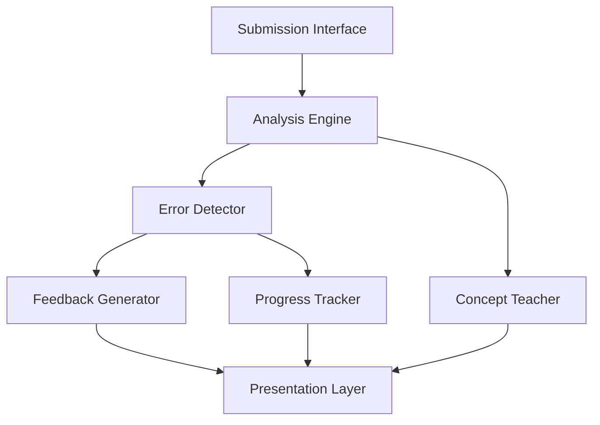

# Design Document: AI Coding Mentor

## Overview

The AI Coding Mentor is an educational platform that provides intelligent, personalized feedback on student code submissions. The system combines static code analysis, pattern recognition, and AI-powered feedback generation to help students learn programming more effectively.

The architecture follows a pipeline approach: code submission → analysis → error detection → feedback generation → presentation. Each stage is modular and can be extended to support additional programming languages and teaching strategies.

### Key Design Principles

1. **Educational Focus**: All feedback prioritizes learning over simply identifying errors
2. **Language Agnostic**: Core architecture supports multiple programming languages through pluggable analyzers
3. **Progressive Disclosure**: Present information in layers, from high-level summaries to detailed explanations
4. **Immediate Feedback**: Provide analysis results quickly to maintain student engagement
5. **Context-Aware**: Tailor explanations based on student experience level and error patterns

## Architecture

The system consists of five primary layers:



### Layer Responsibilities

1. **Submission Interface**: Handles code input from various sources (file upload, text editor, IDE integration)
2. **Analysis Engine**: Parses code and performs static analysis
3. **Error Detector**: Identifies syntax errors, logical errors, and code quality issues
4. **Feedback Generator**: Creates educational explanations and improvement suggestions
5. **Concept Teacher**: Provides interactive programming concept instruction
6. **Progress Tracker**: Records submissions and tracks learning progress
7. **Presentation Layer**: Organizes and displays feedback to students

## Components and Interfaces

### 1. Submission Interface

**Purpose**: Accept and validate code submissions from students

**Interface**:
```typescript
interface SubmissionInterface {
  submitCode(code: string, language: string, metadata: SubmissionMetadata): SubmissionResult
  validateSubmission(code: string, language: string): ValidationResult
  getSupportedLanguages(): string[]
}

interface SubmissionMetadata {
  studentId: string
  timestamp: Date
  fileName?: string
  context?: string
}

interface SubmissionResult {
  submissionId: string
  status: 'accepted' | 'rejected'
  message?: string
}

interface ValidationResult {
  isValid: boolean
  errors: string[]
  warnings: string[]
}
```

**Behavior**:
- Validates file format and size before processing
- Normalizes code formatting for consistent analysis
- Assigns unique submission ID for tracking
- Returns clear error messages for invalid submissions

### 2. Analysis Engine

**Purpose**: Parse code and perform static analysis to extract structure and identify potential issues

**Interface**:
```typescript
interface AnalysisEngine {
  analyze(code: string, language: string): AnalysisResult
  parseCode(code: string, language: string): AbstractSyntaxTree
  getLanguageAnalyzer(language: string): LanguageAnalyzer
}

interface AnalysisResult {
  ast: AbstractSyntaxTree
  symbols: SymbolTable
  controlFlow: ControlFlowGraph
  complexity: ComplexityMetrics
  parseErrors: ParseError[]
}

interface LanguageAnalyzer {
  parse(code: string): AbstractSyntaxTree
  analyze(ast: AbstractSyntaxTree): AnalysisResult
  getSupportedFeatures(): string[]
}

interface ComplexityMetrics {
  cyclomaticComplexity: number
  cognitiveComplexity: number
  linesOfCode: number
  functionCount: number
}
```

**Behavior**:
- Uses language-specific parsers (leveraging existing tools like tree-sitter, Babel, or language-native parsers)
- Builds abstract syntax tree (AST) for structural analysis
- Computes complexity metrics for code quality assessment
- Handles parse errors gracefully and reports them with location information

### 3. Error Detector

**Purpose**: Identify syntax errors, logical errors, runtime issues, and code quality problems

**Interface**:
```typescript
interface ErrorDetector {
  detectErrors(analysisResult: AnalysisResult, code: string): DetectionResult
  detectSyntaxErrors(parseErrors: ParseError[]): SyntaxError[]
  detectLogicalErrors(ast: AbstractSyntaxTree, controlFlow: ControlFlowGraph): LogicalError[]
  detectCodeSmells(ast: AbstractSyntaxTree, metrics: ComplexityMetrics): CodeSmell[]
  prioritizeIssues(issues: Issue[]): Issue[]
}

interface DetectionResult {
  syntaxErrors: SyntaxError[]
  logicalErrors: LogicalError[]
  runtimeWarnings: RuntimeWarning[]
  codeSmells: CodeSmell[]
  allIssues: Issue[]
}

interface Issue {
  id: string
  type: 'syntax' | 'logical' | 'runtime' | 'quality'
  severity: 'error' | 'warning' | 'info'
  location: CodeLocation
  message: string
  category: string
}

interface CodeLocation {
  line: number
  column: number
  endLine?: number
  endColumn?: number
  snippet: string
}
```

**Behavior**:
- Detects syntax errors from parse failures
- Identifies logical errors: unreachable code, infinite loops, incorrect conditionals
- Warns about potential runtime issues: null dereferences, array bounds, type mismatches
- Identifies code smells: duplicate code, long functions, poor naming
- Prioritizes issues by severity and learning impact

### 4. Feedback Generator

**Purpose**: Create educational explanations for errors and suggestions for improvements

**Interface**:
```typescript
interface FeedbackGenerator {
  generateFeedback(issues: Issue[], studentLevel: ExperienceLevel): Feedback[]
  explainError(issue: Issue, studentLevel: ExperienceLevel): Explanation
  suggestImprovement(issue: Issue): ImprovementSuggestion
  groupSimilarIssues(issues: Issue[]): IssueGroup[]
}

interface Feedback {
  issueId: string
  explanation: Explanation
  suggestion?: ImprovementSuggestion
  relatedConcepts: string[]
}

interface Explanation {
  summary: string
  detailedDescription: string
  whyItMatters: string
  commonCauses: string[]
  example?: CodeExample
}

interface ImprovementSuggestion {
  description: string
  benefits: string[]
  beforeCode: string
  afterCode: string
  priority: 'critical' | 'recommended' | 'optional'
}

interface CodeExample {
  incorrect: string
  correct: string
  explanation: string
}

type ExperienceLevel = 'beginner' | 'intermediate' | 'advanced'
```

**Behavior**:
- Generates explanations tailored to student experience level
- Provides concrete before/after examples for improvements
- Groups similar errors to avoid repetitive feedback
- Links errors to relevant programming concepts
- Uses templates for common error patterns, AI generation for complex cases

### 5. Concept Teacher

**Purpose**: Provide interactive instruction on programming concepts

**Interface**:
```typescript
interface ConceptTeacher {
  teachConcept(conceptId: string, studentLevel: ExperienceLevel): ConceptLesson
  getRelatedConcepts(conceptId: string): string[]
  generatePracticeExercise(conceptId: string): Exercise
  evaluateExercise(exerciseId: string, studentCode: string): ExerciseResult
  suggestNextConcepts(studentId: string, masteredConcepts: string[]): string[]
}

interface ConceptLesson {
  conceptId: string
  title: string
  definition: string
  explanation: string
  interactiveExamples: InteractiveExample[]
  practiceExercises: Exercise[]
  relatedConcepts: string[]
}

interface InteractiveExample {
  id: string
  description: string
  initialCode: string
  expectedBehavior: string
  hints: string[]
}

interface Exercise {
  id: string
  description: string
  starterCode: string
  requirements: string[]
  testCases: TestCase[]
}

interface ExerciseResult {
  passed: boolean
  feedback: string
  testResults: TestCaseResult[]
}
```

**Behavior**:
- Presents concepts with clear definitions and explanations
- Provides interactive examples students can modify
- Generates practice exercises with automated evaluation
- Suggests concept progression based on mastery
- Links error patterns to relevant concepts for just-in-time learning

### 6. Progress Tracker

**Purpose**: Record submissions and track student learning progress over time

**Interface**:
```typescript
interface ProgressTracker {
  recordSubmission(studentId: string, submission: SubmissionRecord): void
  getStudentProgress(studentId: string): ProgressReport
  identifyErrorPatterns(studentId: string): ErrorPattern[]
  trackConceptMastery(studentId: string, conceptId: string, mastered: boolean): void
  generateProgressReport(studentId: string, timeRange: TimeRange): ProgressReport
}

interface SubmissionRecord {
  submissionId: string
  timestamp: Date
  language: string
  issuesFound: Issue[]
  issuesFixed: string[]
  codeQualityScore: number
}

interface ProgressReport {
  studentId: string
  totalSubmissions: number
  commonMistakes: ErrorPattern[]
  improvementTrend: TrendData
  conceptsMastered: string[]
  suggestedFocus: string[]
}

interface ErrorPattern {
  errorType: string
  frequency: number
  lastOccurrence: Date
  trend: 'increasing' | 'decreasing' | 'stable'
}
```

**Behavior**:
- Records each submission with detected issues
- Tracks when previously identified errors are fixed
- Identifies recurring error patterns
- Computes improvement metrics over time
- Suggests focus areas based on error patterns

### 7. Presentation Layer

**Purpose**: Organize and display feedback in a clear, navigable format

**Interface**:
```typescript
interface PresentationLayer {
  formatFeedback(feedback: Feedback[], issues: Issue[]): FormattedOutput
  createSummaryView(issues: Issue[]): SummaryView
  highlightCode(code: string, locations: CodeLocation[]): HighlightedCode
  generateNavigationLinks(issues: Issue[]): NavigationLink[]
}

interface FormattedOutput {
  summary: SummaryView
  sections: FeedbackSection[]
  navigation: NavigationLink[]
}

interface SummaryView {
  totalIssues: number
  errorCount: number
  warningCount: number
  suggestionCount: number
  overallScore: number
}

interface FeedbackSection {
  title: string
  items: FeedbackItem[]
  priority: number
}

interface FeedbackItem {
  issue: Issue
  feedback: Feedback
  highlightedCode: HighlightedCode
  navigationLink: string
}
```

**Behavior**:
- Organizes feedback into sections (errors, warnings, suggestions)
- Creates summary view with issue counts
- Highlights relevant code sections
- Provides navigation between feedback items
- Supports multiple output formats (HTML, JSON, plain text)

## Data Models

### Core Data Structures

```typescript
// Abstract Syntax Tree Node
interface ASTNode {
  type: string
  location: CodeLocation
  children: ASTNode[]
  metadata: Record<string, any>
}

// Symbol Table Entry
interface Symbol {
  name: string
  type: string
  scope: string
  location: CodeLocation
  references: CodeLocation[]
}

// Control Flow Graph
interface ControlFlowGraph {
  nodes: CFGNode[]
  edges: CFGEdge[]
  entryNode: string
  exitNodes: string[]
}

interface CFGNode {
  id: string
  type: 'statement' | 'condition' | 'loop' | 'function'
  astNode: ASTNode
}

interface CFGEdge {
  from: string
  to: string
  condition?: string
}

// Student Profile
interface StudentProfile {
  studentId: string
  experienceLevel: ExperienceLevel
  preferredLanguages: string[]
  learningGoals: string[]
  submissionHistory: SubmissionRecord[]
  conceptProgress: ConceptProgress[]
}

interface ConceptProgress {
  conceptId: string
  status: 'not_started' | 'learning' | 'practicing' | 'mastered'
  lastPracticed: Date
  exercisesCompleted: number
  successRate: number
}
```

### Storage Schema

The system requires persistent storage for:

1. **Student Profiles**: Store student information, preferences, and learning goals
2. **Submission History**: Record all code submissions and analysis results
3. **Concept Library**: Store programming concepts, lessons, and exercises
4. **Error Templates**: Store common error patterns and feedback templates
5. **Progress Metrics**: Store aggregated progress data for reporting

Storage can be implemented using:
- Relational database (PostgreSQL) for structured data (profiles, submissions)
- Document store (MongoDB) for flexible data (AST, analysis results)
- Cache layer (Redis) for frequently accessed data (error templates, concept library)

## Correctness Properties


*A property is a characteristic or behavior that should hold true across all valid executions of a system—essentially, a formal statement about what the system should do. Properties serve as the bridge between human-readable specifications and machine-verifiable correctness guarantees.*

### Analysis and Parsing Properties

**Property 1: Valid code parsing succeeds**

*For any* syntactically valid code in a supported language, parsing should succeed and produce a valid abstract syntax tree without errors.

**Validates: Requirements 1.1**

**Property 2: Syntax error location accuracy**

*For any* code containing syntax errors, the Analysis_Engine should identify all syntax error locations with accurate line and column numbers that correspond to the actual error positions.

**Validates: Requirements 1.2, 2.1**

**Property 3: Multi-language support**

*For any* supported programming language (Python, JavaScript, Java, C++), valid code in that language should parse successfully and produce language-appropriate analysis results.

**Validates: Requirements 1.5**

**Property 4: Logical error detection**

*For any* syntactically valid code containing logical errors (infinite loops, unreachable code, incorrect conditionals), the Analysis_Engine should detect and report these issues.

**Validates: Requirements 1.3, 2.3**

**Property 5: Runtime warning detection**

*For any* code containing potential runtime errors (null dereferences, array bounds violations, type mismatches), the Analysis_Engine should identify and warn about these issues.

**Validates: Requirements 2.2**

**Property 6: Code smell identification**

*For any* code containing code smells (duplicate code, overly complex functions, poor naming), the Analysis_Engine should identify these quality issues.

**Validates: Requirements 2.4**

**Property 7: Issue prioritization**

*For any* analysis result containing multiple issues of different severities, the issues should be ordered with errors before warnings before suggestions, and within each category by impact.

**Validates: Requirements 2.5**

### Feedback Generation Properties

**Property 8: Error explanations completeness**

*For any* detected error, the generated feedback should include a non-empty explanation describing what the error is and why it occurs.

**Validates: Requirements 3.1**

**Property 9: Error feedback includes examples**

*For any* error feedback, the explanation should include a concrete code example demonstrating the correct approach.

**Validates: Requirements 3.2**

**Property 10: Experience-appropriate language**

*For any* error and student experience level, the generated feedback should use vocabulary and complexity appropriate to that level (simpler for beginners, more technical for advanced).

**Validates: Requirements 3.3**

**Property 11: Similar error grouping**

*For any* set of similar errors (same error type, same root cause), the feedback should group them together and provide a single comprehensive explanation rather than repeating the same feedback.

**Validates: Requirements 3.4**

**Property 12: Educational context requirement**

*For any* generated feedback, the explanation should contain educational context beyond just stating the error message (including why it matters, common causes, or how to fix it).

**Validates: Requirements 3.5**

### Improvement Suggestion Properties

**Property 13: Improvement opportunity detection**

*For any* code with opportunities for improving readability, maintainability, or performance, the system should identify and suggest these improvements.

**Validates: Requirements 4.1**

**Property 14: Improvement examples completeness**

*For any* improvement suggestion, the feedback should include both before-code and after-code examples showing the recommended change.

**Validates: Requirements 4.2**

**Property 15: Suggestion prioritization**

*For any* set of multiple improvement suggestions, they should be ordered by impact and learning value, with critical fixes before recommended improvements before optional enhancements.

**Validates: Requirements 4.3**

**Property 16: Priority categorization**

*For any* improvement suggestion, it should be tagged with an appropriate priority level (critical, recommended, or optional) that reflects the importance of the change.

**Validates: Requirements 4.4**

**Property 17: Benefit explanation requirement**

*For any* improvement suggestion, the feedback should include an explanation of the benefits of making the proposed change.

**Validates: Requirements 4.5**

### Concept Teaching Properties

**Property 18: Concept lesson completeness**

*For any* concept instruction request, the returned lesson should include a clear definition, detailed explanation, and structured content.

**Validates: Requirements 5.1**

**Property 19: Interactive examples inclusion**

*For any* concept lesson, it should include at least one interactive example that students can modify and experiment with.

**Validates: Requirements 5.2**

**Property 20: Error-to-concept linking**

*For any* detected error that relates to a specific programming concept, the system should offer to teach that concept in detail.

**Validates: Requirements 5.3**

**Property 21: Practice exercises inclusion**

*For any* concept lesson, it should include practice exercises with automated evaluation capability for immediate feedback.

**Validates: Requirements 5.4**

**Property 22: Concept progression tracking**

*For any* student who has mastered a set of concepts, the system should suggest related advanced topics that build on the mastered concepts.

**Validates: Requirements 5.5**

### Submission Handling Properties

**Property 23: Multiple input method support**

*For any* valid code submission, it should be accepted successfully regardless of whether it comes via file upload, direct text input, or editor integration.

**Validates: Requirements 6.1**

**Property 24: Format validation**

*For any* code submission, the system should validate the file format and accept supported formats while rejecting unsupported ones.

**Validates: Requirements 6.2**

**Property 25: Unsupported format error messages**

*For any* submission with an unsupported file format, the system should return an error message that lists all supported formats.

**Validates: Requirements 6.3**

**Property 26: Size limit enforcement**

*For any* submission exceeding the size limit, the system should reject it and provide an error message stating the maximum allowed size.

**Validates: Requirements 6.4**

**Property 27: Formatting preservation (round-trip)**

*For any* submitted code, retrieving the stored submission should return code with the same formatting, whitespace, and structure as the original.

**Validates: Requirements 6.5**

### Presentation Properties

**Property 28: Feedback organization**

*For any* analysis result, the formatted output should organize feedback into distinct sections for errors, warnings, and suggestions.

**Validates: Requirements 7.1**

**Property 29: Code location references**

*For any* error or feedback item referencing a specific code location, the output should include both highlighted code and navigation links to that location.

**Validates: Requirements 7.2, 7.5**

**Property 30: Navigation capability**

*For any* analysis result with multiple feedback items, the output should include navigation mechanisms (links, indices, or controls) to move between items.

**Validates: Requirements 7.3**

**Property 31: Summary accuracy**

*For any* analysis result, the summary view should accurately reflect the total count of issues by category (errors, warnings, suggestions).

**Validates: Requirements 7.4**

### Progress Tracking Properties

**Property 32: Submission persistence**

*For any* code submission and its analysis results, the system should store the submission record and make it retrievable by submission ID.

**Validates: Requirements 8.1**

**Property 33: Improvement recognition**

*For any* student who submits code with previously identified errors fixed, the system should recognize and record the improvement.

**Validates: Requirements 8.2**

**Property 34: Error history maintenance**

*For any* student with multiple submissions, the system should maintain a history of common mistakes and track when specific error types stop occurring.

**Validates: Requirements 8.3**

**Property 35: Pattern-based suggestions**

*For any* student with recurring error patterns, the system should identify the patterns and suggest focused learning resources related to those error types.

**Validates: Requirements 8.4**

**Property 36: Progress report generation**

*For any* student with submission history, requesting a progress report should return metrics including improvement trends, concepts mastered, and suggested focus areas.

**Validates: Requirements 8.5**

## Error Handling

The system must handle various error conditions gracefully:

### Input Validation Errors

- **Invalid file format**: Return clear error message listing supported formats
- **Oversized submission**: Reject with message stating size limit
- **Empty submission**: Return error requesting valid code input
- **Corrupted file**: Return error indicating file cannot be read

### Analysis Errors

- **Parse failure**: Capture parse errors and present them as syntax errors with locations
- **Unsupported language feature**: Warn about unsupported features but continue analysis where possible
- **Analysis timeout**: Return partial results with warning about incomplete analysis
- **Resource exhaustion**: Gracefully degrade (e.g., skip complex analysis) and inform user

### Feedback Generation Errors

- **Missing error template**: Fall back to generic explanation with error details
- **AI service unavailable**: Use template-based feedback as fallback
- **Concept not found**: Return error suggesting available concepts

### Storage Errors

- **Database unavailable**: Queue submissions for later processing, inform user
- **Storage full**: Return error and suggest contacting administrator
- **Retrieval failure**: Return error with submission ID for support

### Error Response Format

All errors should follow a consistent format:

```typescript
interface ErrorResponse {
  success: false
  error: {
    code: string
    message: string
    details?: string
    suggestedAction?: string
  }
}
```

## Testing Strategy

The AI Coding Mentor requires comprehensive testing across multiple dimensions to ensure correctness, reliability, and educational effectiveness.

### Dual Testing Approach

The system will employ both unit testing and property-based testing:

- **Unit tests**: Verify specific examples, edge cases, and error conditions
- **Property tests**: Verify universal properties across all inputs
- Both approaches are complementary and necessary for comprehensive coverage

Unit tests are helpful for specific examples and edge cases, but we should avoid writing too many unit tests since property-based tests handle covering lots of inputs. Unit tests should focus on:
- Specific examples that demonstrate correct behavior
- Integration points between components
- Edge cases and error conditions

Property tests should focus on:
- Universal properties that hold for all inputs
- Comprehensive input coverage through randomization

### Property-Based Testing Configuration

We will use **fast-check** (for TypeScript/JavaScript) as our property-based testing library. Each property test will:

- Run a minimum of 100 iterations to ensure comprehensive coverage
- Reference its corresponding design document property
- Use the tag format: **Feature: ai-coding-mentor, Property {number}: {property_text}**

Each correctness property defined in this document must be implemented by a single property-based test.

### Testing Layers

#### 1. Component Unit Tests

Test individual components in isolation:

- **Submission Interface**: Test validation logic, format detection, size limits
- **Analysis Engine**: Test parsing for each supported language, AST generation
- **Error Detector**: Test detection of specific error types with known examples
- **Feedback Generator**: Test explanation generation, example formatting
- **Concept Teacher**: Test lesson retrieval, exercise generation
- **Progress Tracker**: Test recording, retrieval, metric calculation
- **Presentation Layer**: Test formatting, section organization, navigation generation

#### 2. Property-Based Tests

Implement all 36 correctness properties as property-based tests:

- Generate random valid/invalid code for analysis properties
- Generate random error scenarios for feedback properties
- Generate random submission patterns for tracking properties
- Verify invariants hold across all generated inputs

#### 3. Integration Tests

Test component interactions:

- End-to-end flow: submission → analysis → feedback → presentation
- Error detection → feedback generation pipeline
- Concept teaching triggered by error patterns
- Progress tracking across multiple submissions

#### 4. Language-Specific Tests

For each supported language (Python, JavaScript, Java, C++):

- Test parsing of valid language constructs
- Test detection of language-specific errors
- Test language-specific code smells
- Verify feedback uses language-appropriate terminology

#### 5. Educational Effectiveness Tests

While harder to automate, these tests verify educational quality:

- Feedback clarity: Manual review of generated explanations
- Example correctness: Verify all code examples compile and run
- Concept progression: Verify suggested concepts build appropriately
- Experience level appropriateness: Review feedback for different levels

### Test Data Strategy

- **Synthetic code generation**: Create code samples with known errors for testing
- **Real student submissions**: Use anonymized real submissions for validation (with permission)
- **Error corpus**: Maintain library of common errors for regression testing
- **Language test suites**: Use existing language test suites for parser validation

### Continuous Testing

- Run unit tests on every commit
- Run property tests nightly (due to longer execution time)
- Run integration tests before releases
- Monitor production errors and add regression tests

### Success Metrics

Testing is successful when:
- All unit tests pass (100% pass rate)
- All property tests pass across 100+ iterations
- Code coverage exceeds 80% for core components
- No critical bugs in production for 30 days
- Student feedback indicates clear, helpful explanations
